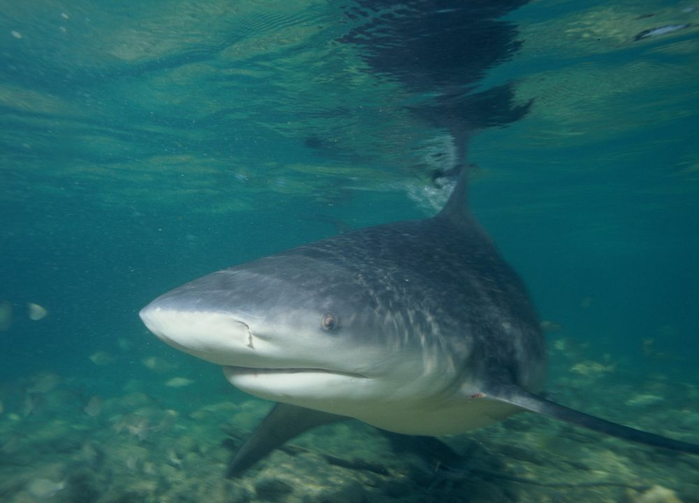
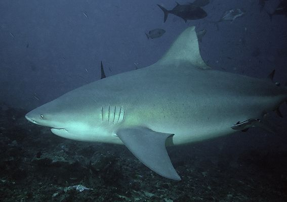

황소상어
============
|분류: 흉상어속 / 상어|
|----------|

||
|---------------------------------||
|황소상어|
|--------||
|Bull shark|이명:(없음)|
|-----------|-------------|
|Carcharhinus leucas J. P. Müller and Henle, 1839|
|---------------------||
